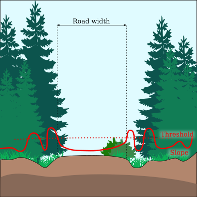

```{r,echo=FALSE,message=FALSE,warning=FALSE}
library(lidR)
library(raster)
library(sf)
library(ALSroads)

r3dDefaults = rgl::r3dDefaults
m = structure(c(0.921, -0.146, 0.362, 0, 0.386, 0.482, -0.787, 0, 
-0.06, 0.864, 0.5, 0, 0, 0, 0, 1), .Dim = c(4L, 4L))
r3dDefaults$FOV = 50
r3dDefaults$userMatrix = m
r3dDefaults$zoom = 0.75

knitr::opts_chunk$set(
  comment =  "#>", 
  collapse = TRUE,
  fig.align = "center")

rgl::setupKnitr(autoprint = TRUE)
```

# Standard Parameters {#sec-standard-parameters}

The `meaure_roads()` function is built with a series of standard parameters. Users can change these parameter to suit the study areas for which road extraction is being completed. Most of the standard parameters are not expected to be changed, and are suitable for road extraction across different areas. All the `measure_roads()` parameters are described below but only the ones in **bold** will significantly impact method in a predictable way, and should be considered by users.

If users need to customize the `measure_roads()` standard parameters it is strongly recommended that they read the [method source paper](https://www.sciencedirect.com/science/article/pii/S1569843222002084#d1e1483).

## Extraction Parameters: {#sec-extraction-parameters}

Several of the `meaure_roads()` parameters are used to extract the point cloud, process it into small sections, and compute road profiles.

-   [road_max_len] Default = 2000 m. Maximum size of a processed road section. If a road is longer than this value it will be split in chunks of equal sizes that are each less than than the max road length value. The goal of this parameter is to reduce memory usage and computation time, and avoid processing a long road strait without optimization.

-   **[road_buffer]** Default = 80 m. Width of a buffer around the existing road for point-cloud extraction. The algorithm processes only the point cloud within the buffer around the reference roads (see figure below). This value corresponds to the biggest road offset error (i.e., how incorrect the existing road track is) that can be fixed by the method. If the road buffer is 80 m, but a given road is 100 m off the real track, then the real road will be outside the extracted point cloud and won't be found. If the user knows that the road track error can be up to 100 m then a road buffer value of 120 m is necessary rather than the default value (80 m ). If the user knows that the maximum road track error is at most 30 m, then a buffer of 40 m will increase computation speed and reduce the chance of produce erroneous results.

    <center></center>

-   [road_max_width] Default = 30 m. Maximum width of a road for metric measurements. If the road is relocated with a default buffer of 80 m (see parameter **road_buffer** below) the measurement of the road is done with a buffer of 30 m only to reduce computation time. Indeed once we have the proper location of the road the edges are necessarily at +/- 10 m of the centerline at maximum. Using 30 m ensures to have more context on the sides.

-   [section_length] Default = 10 m. Length of sections of road for metrics measurements. Roads are divided into sections, and for each section the road width, road state, and other metrics are computed iteratively by processing slices perpendicular to the road. For example, using the default road section length (10 m), a 500m road will be split into 50 sections.

-   [profile_resolution] Default = 0.5 m. Resolution of the profiles and DTMs for metrics measurements (see fig 6 in the method [paper](https://www.sciencedirect.com/science/article/pii/S1569843222002084?via%3Dihub)).

## Embankments Parameters: {#sec-embankments-parameters}

The `meaure_roads()` function includes one parameter that specifies how the algorithm deals with embankments in the terrain.

-   [min_slope] Default = 10 degrees. Slope (degrees) greater than the min_slope may initiate or terminate the detection of embankments. For example, if a slope of greater than 10 degrees is encountered on the right or on the left of the road centerline the method will consider this point to be an edge of the road. This is illustrated in the figure below. Nice slopes to ditches are expected to be detected to delimitate the road.

<center></center>

## Terrain Parameters (excluding embankment): {#sec-terrain-parameters}

The `meaure_roads()` function includes two parameters that specify how the algorithm detects roads edges in the terrain aspect, excluding embankment/shoulder (see section \@ref(sec-embankments-parameters) for embankment parameters).

The purpose of these parameters is to allow the algorithm to find the edges of the road, even in the absence of embankments. Classifying the edges of roads using embankments is the preferable method. In the absence of clear embankments, defined by the road edge slopes, the method relies on the DTM complexity of each road section (see section \@ref(sec-extraction-parameters) for information on road sections) to classify the edges of the road. We refer to the classification of road edges using DTM complexity as the *"rescue method"* as it is used when the preferred method based on road embankment is not possible.

The idea is that a road is flat an simple. If we get rid of the potential slope along its direction a road is roughly a 2D strip without variations on Z. The outer of the road on another hand correspond to natural landscape and is more complex. It corresponds to a 3D structure with variations on Z. On a given slice perpendicular to the road if we compute some adequate metrics on the ground points from the left to the right we obtain a profile that is expected to have higher values outside the boundaries of the road and low values close to zero inside. This profile often looks a bit like a parabola. By choosing an adequate threshold we can define road edges. This is illustrated in the figure below.

<center></center>

-   **[max_sd_ground_points]** Default = 0.1. LiDAR ground points belonging to roads have a low dispersion on Z profiles because a road is relatively flat (refer to fig 6 in the method [paper](https://www.sciencedirect.com/science/article/pii/S1569843222002084?via%3Dihub)). Beyond the limits of a road, this standard deviation of ground points starts to increase because the terrain is more complex. This value is a threshold at which the edge of the road are detected with the rescue method.

-   **[max_elevation_ground_points]** Default = 0.15. The algorithm normalizes the point cloud relative to the road (i.e., the ground point from the road are expected to be at 0 and the surrounding points are expected to be non-zero). The rescue method used this property to detected road edges.

Notice that the embankments and rescue methods are not mutualy exclusive. In many cases a ditch may be detected on one side and the rescue method is used on the other side. Changing these parameters is particularly important when the topography is flat. As the reader can see, a road is detected, using both methods, based on geometrical features. When there is barely nothing to detect the algorithm fails and overestimates the road width. Decreasing these thresholds mechanically lead to narrow the road size detected.

## Vegetation: {#sec-vegetation-parameters}

Once we have the width of the road i.e. the size of the road that has been build the method estimate the drivable width which is the road width minus the vegetation that impede the passage. The idea is that is is possible to recognize a road in the DTM because the geometry is there but the vegetation has grown and the road is no longer drivable. On a road all the lidar point are expected to be on the ground. Accounting for innacuracies we assume that 100% of the point must be between 0 and 50 cm. If some points are above that it means that there is some vegetation. 1 point might be an outline but a significant percentage of the point trigger a stop signal. Starting from the centerline and going both to the left and right, the method compute the cumulative percentage of non ground points. This produce a profile that is threshold like for the regular width measurement (see figure bellow).

<center></center>

-   **[max_percentage_drivable]** Default = 0.15. This is the threshold explained above.

## Conductivity Parameters: {#sec-conductivity-parameters}

A key component of the `measure_roads()` method is the development of a conductivity layer, where pixel values indicate the likelihood that the pixel is or is not drivable. Conductivity parameters correspond to the method used to estimate the overall conductivity layer using multiple sub-conductivity layers. Each layer is described in fig 3 of the method [paper](https://www.sciencedirect.com/science/article/pii/S1569843222002084?via%3Dihub) and are activated using activation function. These activation functions have two thresholds, unless otherwise stated, the values below correspond to these thresholds. It is recommended to **do not** change the default parameter. Anyway it is hard to guess what may be the consequences of changing the parameters without running the internal code and internal display functions not exposed to users.

-   **[sigma_min]** Default = 0.1. The conductivity cannot be lower than this value. The conductivity layer construction is done such as conductivity values can range from 0 to 1. However, very low values (\<0.1) are problematic as they may form a gap in the road and result in a false negative. For example, the gap may be interpreted as an impassible obstacle. Version 0.2.0 of the `ALSroads` package (not the one describe in the method [paper](https://www.sciencedirect.com/science/article/pii/S1569843222002084?via%3Dihub) which is 0.1.0) introduced this parameter to allow the method to cross small gaps in the conductivity layer.

-   [s] Default = `c(5, 20)`. The slope (s) of the terrain indicating where a road cannot be. If the slope of the terrain is greater than the max slope, then a road cannot be present. To avoid binary logic and a hard threshold, a second threshold is introduced at 5° to transform the slope map into a sub-conductivity map using a piecewise-linear activation function. A slope of \< 5° has a conductivity of 1, between 5° and 20° the conductivity decreases linearly to 0, making it impossible to move through pixels with steeper slopes.

-   [r] Default = `c(0.05, 0.1)`. The roughness (r) sub-conductivity layer is based on the assumption that a road surface is anticipated to be a smooth surface in a relatively rough environment.

-   [e] Default = 40. This is a simple threshold activation function.

-   [q] Default = `c(0.1, 0.5)`. Intensity range (q) (difference between the maximum and the minimum) as an estimation of the intensity homogeneity. Rather than using the absolute thresholds, which are not applicable broadly with intensity, we use local and auto-adaptive thresholds, based on two percentiles of intensity. Here the 10th and 50th percentaile of intensities are used as thresold values for the activation function.

-   [h] Default = `c(0.1, 0.2)`. The CHM can be interpreted to infrom gaps in the canopy, low CHM (h) values are interpreted to indicate the location of a drivable surface.

-   [d] Default = `c(0.25, 0.95)`. Ground points density values cannot be used directly because of their dependence on the local nominative sampling density Consequently, we opted for auto-adaptive thresholds based on two percentiles of density (d).

-   [alpha] Default `list(h = 1, d = 2, r = 1, i = 1)`. This is the alphas parameters in equation 1 in the method [paper](https://www.sciencedirect.com/science/article/pii/S1569843222002084?via%3Dihub).

## Road State Parameters: {#sec-state-parameters}

Using the `measure_roads()` function users classify roads into four classes (see section \@ref(sec-network-update). These classes are determined using four metrics derived from the point-clouds (fig 7 of the method [paper](https://www.sciencedirect.com/science/article/pii/S1569843222002084?via%3Dihub)):

1.  W - the drivable width of the road,
2.  P - the percentage of vegetation points between 0.5 and 5 meters above the road,
3.  S - the average number of shoulders detected and,
4.  σ - the conductivity per linear meter.

An activation function is applied to the four metrics. These activation functions have two parameters. The following are the two parameters of each activation function. Modifying these thresholds have predictable behaviours but it is hard to quantify these behaviours. The idea is that each metrics weight in a simple voting system for a class. If the method detected something large `W` is "voting" for a nice and large class 1 road but in the mean time `P` may "vote" for an abandoned road because there is a lot of vegetation. And S may indicate that nice ditches where found everywhere so the road looks nice. Overall the road my be classified 2.

-   **[drivable_width_thresholds]** Default `c(1, 5)`. Roads with a drivable road width above 5 m are assigned a score of 100. Roads with a width less than 1 m are assigned a score of 0.Indeed if the width is too narrow it is unlikely to be a nice road. The is a linear relationship between 1 and 5 i.e. a with of 2 m returns a score of 50%. If the users do know that in their context a road of 4 m is a fair road we recommend changing the parameter to something like `c(1, 3)` for example.

-   **[percentage_veg_thresholds]** Default = `c(10,40)`. Roads with a percentage vegetation (point above ground in a range of [0.5m, 5m]) below 10% are assigned a score of 100%. Roads with a percentage greater than 40% are assigned a score of 0%. There is a linear relationship between the lower and upper percentage vegetation thresholds.

-   **[shoulder_thresholds]** Default = `c(50, 75)`. For each slice of the road (see 'section_length' in section \@ref(sec-extraction-parameters)) the algorithm retains the count of the shoulder/embankments found. For each road it is possible to find 0, 1, or 2 shoulder/embankments. If the algorithm consistently finds two shoulder (one on the left and one on the right) for each road segment the road is extremely well shaped and we have 100% of the possible count. However, in practice, roads are very rarely shaped well enough that two shoulder/embankments per section can be consistently found. This parameter counts the percentage of shoulders found. A shoulder percentage of 0 % means that the algorithm did not find any shoulders at any road section, and the road is likely poor quality if a road at all. If 100% of the road shoulders are found the road is well shaped and the road score is 100%. If under 50 % of the road shoulders are found for the entire road the road score is 0%. Changing this parameter may be clever is users know that the roads are not shaped with strong ditches. Ultimatley it might be required to deactivate it. This is not yet possible but could be done on demand.

-   [conductivity_thresholds] Default = c(0.25, 0.5). If the conductivity of the road is too low (\< 0.25) the road score is 0% (see section \@ref(sec-conductivity-parameters)). If the conductivity is above 0.5 the score is 100%. The road score between these thresholds is linear. We do not recommand changing that because users do not have a strong control on the conductivity layer and therefore manipulating this parameter is done blindly.

Once the algorithm calculates a score for each of the four metrics, these scores are combined into a final score (fig 7 of the method [paper](https://www.sciencedirect.com/science/article/pii/S1569843222002084?via%3Dihub)). This score can be used as is but is also binned in four classes where Class 4 corresponds to a score [0, 25[, Class 3 to a score [25, 50[ and so on.
