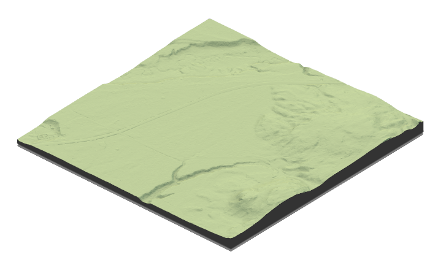

```{r,echo=FALSE,message=FALSE,warning=FALSE}
library(lidR)
library(ggplot2)
library(raster)
library(sf)
library(forcats)

r3dDefaults = rgl::r3dDefaults
m = structure(c(0.921, -0.146, 0.362, 0, 0.386, 0.482, -0.787, 0, 
-0.06, 0.864, 0.5, 0, 0, 0, 0, 1), .Dim = c(4L, 4L))
r3dDefaults$FOV = 50
r3dDefaults$userMatrix = m
r3dDefaults$zoom = 0.75

knitr::opts_chunk$set(
  comment =  "#>", 
  collapse = TRUE,
  fig.align = "center")

rgl::setupKnitr(autoprint = TRUE)

#Case study: DTM compx

las_infolder <- ("data/06/01/ctg/")
ctg_cs1 <- readLAScatalog(las_infolder, filter = "-drop_withheld -keep_random_fraction 0.25")
dtm_cs1 <- raster("data/06/01/DTM.tif")
dtm20 <- raster("data/06/01/DTM20.tif")
rds_cs1 <- st_read("data/06/01/roads.shp")
upd_rds_cs1 <- st_read("data/06/01/upd_roads.shp") # Standard Parameters
```

# Edge Case Studies {#sec-edge-case-studies}

In this section, we present three known edge case studies where the `measure_road()` standard parameters may require tuning:

-   **Low DTM complexity** (i.e., an area of uniform elevation)
-   **Steep slopes** (i.e., an area characterized by steep slopes)
-   **No vegetation** (i.e., an area where the road is not clearly defined by vegetation), there are three known no vegetation scenarios:
    1.  The roads are nicely shaped, and it is not an edge case it should works
    2.  The DTM is very flat and we are in 2.1
    3.  It so hard to find the road that even the least cost path fails because the roads are not highlighted enough compared to the surrounding vegetation. In that case we are facing a hard limit.

## Structure:

For each case study, we include code snippets outlining how to:

1.  Read the required input data, detailed information is available in Section \@ref().
2.  Check the Coordinate Reference System of input data and clip the existing road network to the spatial extent of the LAZ catalog.
3.  Update the existing road network using the `measure_roads()` function.
4.  Adjust road extraction parameters to improve method accuracy, where applicable, detailed information on `measure_roads()` standard parameters is available in Section \@ref().
5.  Visualize road extraction results.

Each case study is 'stand-alone' and users do not need to refer to other sections of the user guide. As such, some code snippets, such as loading data, are repeated for each case study.

## Case Study: Low DTM complexity {#sec-case-study-low-dtm-complexity}

### Overview: {#sec-overview}

Among other factors, such as vegetation and slope, the road extraction method developed by [Roussel et al. (2022)](%5Bhttps://www.sciencedirect.com/science/article/pii/S1569843222002084#d1e1483) uses the complexity of the input DTM to correctly position the updated road. The road extraction works by applying a Sobel filter [(Sobel. 2014)](https://www.researchgate.net/publication/239398674_An_Isotropic_3x3_Image_Gradient_Operator) on the DTM to detect sharp road edges. In areas where the DTM is not complex (i.e., there is minimal variation between pixels in the DTM) the road may still be detectable using other surfaces, such as a CHM, slope, or roughness raster. Under ideal circumstances, the DTM is complex enough that the algorithm can distinguish between the drivable and total road edge by assessing groves in the road edge and road shoulder.

In this case study, we update a section of roads located in the eastern portion of the Nipissing Forest, located in the province of Ontario.



### Method and Application: {#sec-method-and-application}

#### Loading Data: {#sec-loading-data}

``` r
ctg <- readLAScatalog"path/to/ctg/files", filter = "-drop_withheld -keep_random_fraction 0.25")
dtm <- raster("path/to/dtm.tif")
roads <- st_read("path/to/roads")

st_crs(roads) = st_crs(ctg)
roads = sf::st_crop(roads, ctg)
```

#### Parameter Tuning {#sec-parameter-tuning}

We adjust the the standard `measure_roads()` parameters, explained in section \@ref(). **The maximum elevation ground points is set to to 0.07 and the maximum standard deviation of ground points to 0.04.**

``` r
custom_param = alsroads_default_parameters
custom_param$terrain$max_elevation_ground_points = 0.07
custom_param$terrain$max_sd_ground_points = 0.04

updated_roads_custom_param <- measure_roads(ctg = ctg, roads = roads, dtm = dtm, param = custom_param)
```

### Results: {#sec-results}

Plotting the updated road network alongside the existing road network allows the visualization of the updated roads.

```{r, echo = FALSE, fig.width = 7.1, fig.height = 7}
poly = mapply(function(x,y)
{
  x = st_geometry(x)
  if (!is.na(y)) 
    x = st_buffer(x, dist = y) 
  else 
    x = st_buffer(x, dist = 0.1)
  return(st_sf(st_sfc(x)))
}, 
st_geometry(upd_rds_cs1), 
upd_rds_cs1$ROADWID)
poly = do.call(c, poly)
st_crs(poly) = st_crs(upd_rds_cs1)

plot(dtm_cs1, col = gray((0:25)/25))
plot(st_geometry(rds_cs1), add = T)
col = c("lightgray", "darkgreen", "orange", "red", "black")[upd_rds_cs1$CLASS+1]
plot(poly, add = T, col = col, border = col, lwd = 2)
```

## Case Study: Steep Slopes {#sec-case-study-steep-slopes}

### Overview:

The road extraction method functions by combining information, such as terrain slope, intensity map, and CHM, to estimate how difficult it is to move from cell to cell. Low conductivity is attributed to pixels where a road is unlikely to be, and high conductivity where a road is likely to be. The road shoulders are detected to derive the road width based on abrupt variations of the slope. In the absence of clear shoulders, road edges are detected using the DTM complexity as shown in \@ref().

Within the `measure_roads()` function, terrain slope is computed according to [Horn (1981)](https://www.researchgate.net/publication/2996084_Hill_shading_and_the_reflectance_map) method, and implemented using the `raster` package. The slope of the terrain indicates where a road cannot be with certainty. If the slope of the terrain is greater than a pre-set degree value S, then a road cannot be present. S is often defined by local legislation and is considered a known parameter. A slope of \< 5° has a conductivity of 1, between 5 and S ° the conductivity decreases linearly to 0, making it impossible to move through pixels with steeper slopes.

The standard parameter for S, refer to section \@ref(), in the road extract algorithm is 20 °. This parameter can be adjusted to account for areas where local legislation provides a specific S value.

### Method and Application

#### Loading Data:

``` r
ctg <- readLAScatalog"path/to/ctg/files", filter = "-drop_withheld -keep_random_fraction 0.25")
dtm <- raster("path/to/dtm.tif")
roads <- st_read("path/to/roads")
```

``` r
st_crs(roads) = st_crs(ctg)
roads = sf::st_crop(roads, ctg)
```

#### Parameter Tuning

#### Updating roads using `measure_roads()`

`measure_roads()` is run using the custom parameters.

``` r
updated_roads_custom_param <- measure_roads(ctg = ctg, roads = roads, dtm = dtm, param = custom_param)
```

### Results:

Plotting the updated road network alongside the existing road network allows the visualization of the updated roads.

``` r
m = mapview::mapview(list(roads, updated_roads),
  layer.name = c("Inaccurate", "Corrected"),
  color = c("red", "blue"), map.type = "Esri.WorldImagery")
leaflet::addTiles(m@map)
```

## Case Study: No Vegetation {#sec-case-study-no-veg}

### Scenario One: The roads are nicely shaped, and it is not an edge case it should works

### Scenario Two: The DTM is very flat and we are in 2.1

### Scenario Three: It so hard to find the road that even the least cost path fails because the roads are not highlighted enough compared to the surrounding vegetation. In that case we are facing a hard limit.
