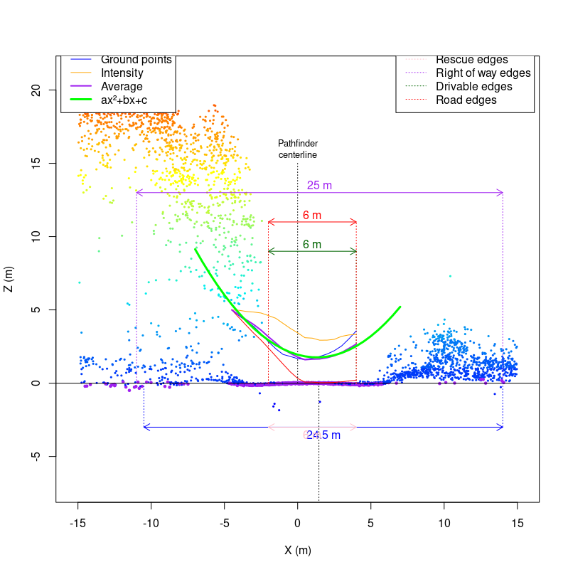

```{r,echo=FALSE,message=FALSE,warning=FALSE}
library(lidR)
library(ggplot2)
library(raster)
library(sf)

r3dDefaults = rgl::r3dDefaults
m = structure(c(0.921, -0.146, 0.362, 0, 0.386, 0.482, -0.787, 0, 
-0.06, 0.864, 0.5, 0, 0, 0, 0, 1), .Dim = c(4L, 4L))
r3dDefaults$FOV = 50
r3dDefaults$userMatrix = m
r3dDefaults$zoom = 0.75

knitr::opts_chunk$set(
  comment =  "#>", 
  collapse = TRUE,
  fig.align = "center")

rgl::setupKnitr(autoprint = TRUE)
knitr::opts_chunk$set(echo = TRUE)
#Case study 1: DTM compx

las_infolder <- ("data/06/01/ctg/")
ctg_cs1 <- readLAScatalog(las_infolder, filter = "-drop_withheld -keep_random_fraction 0.25")
dtm_cs1 <- raster("data/06/01/DTM.tif")
dtm20 <- raster("data/06/01/DTM20.tif")
rds_cs1 <- st_read("data/06/01/roads.shp")
upd_rds_cs1 <- st_read("data/06/01/upd_roads.shp") # Standard Parameters

#Case study 2: Vegetation

las_cs2 <- readLAS("data/06/02/ctg/1kmZ174510538902018L.laz")
las_infolder <- ("data/06/02/ctg/")
ctg_cs2 <- readLAScatalog(las_infolder, filter = "-drop_withheld -keep_random_fraction 0.25")
dtm_cs2 <- raster("data/06/02/DTM.tif")
rds_cs2 <- st_read("data/06/02/road.shp")

#Case study 3: Narrow Buffer

las_infolder <- ("data/06/03/ctg/")
ctg_cs2 <- readLAScatalog(las_infolder, filter = "-drop_withheld -keep_random_fraction 0.25")
rds_cs2 <- st_read("data/06/03/roads.shp")
dtm_cs2 <- raster("data/06/03/DTM.tif")
upd_rds_cs2 <- st_read("data/06/03/upd_roads.shp") # Standard Parameters
upd_rds_custom_cs2 <- st_read("data/06/03/upd_roads_custom.shp") #Custom Parameters (buff == 40)

#Case Study 4: Drivable width 

las_infolder <- ("data/06/03/ctg/")
ctg_cs2 <- readLAScatalog(las_infolder, filter = "-drop_withheld -keep_random_fraction 0.25")
rds_cs2 <- st_read("data/06/03/roads.shp")
dtm_cs2 <- raster("data/06/03/DTM.tif")
upd_rds_cs4 <-  st_read("data/06/04/upd_roads.shp") # Standard Parameters
upd_rds_custom_cs4 <- st_read("data/06/04/upd_roads_custom.shp") 
upd_rds_custom_and_standard_cs4 <- st_read("data/06/04/upd_roads_custom_and_standard.shp")
```

# Case Studies {#sec-edge-case-studies}

In this section, we present four case studies where the `measure_road()` standard parameters (see section \@ref(sec-standard-parameters) may require tuning:

-   **Case Study 1: Low DTM complexity**
-   **Case Study 2: No vegetation**
-   **Case Study 2: Narrow/Wide Roads**
-   **Case Study 3: Drivable Width Thresholds**

## Case Study Structure:

For each case study, we include code snippets outlining how to:

1.  Read the required input data (refer to section \@ref(sec-reading-generating-and-plotting-input-data) for detailed information).
2.  Check the Coordinate Reference System (CRS) of input data and clip the existing road network to the spatial extent of the LAS catalog.
3.  Update the existing road network using the `measure_roads()` function from the `ALSroads` package.
4.  Adjust the standard road extraction parameters to improve method accuracy (see section \@ref(sec-standard-parameters) for information on the standard parameters).
5.  Visualize road extraction results.

Each case study is 'stand-alone', and users do not need to refer to other sections of the user guide. As such, some code snippets, such as loading data, are repeated for each case study.

## Case Study 1: Low DTM complexity {#sec-case-study-low-dtm-complexity}

### Overview:

The road extraction method developed by [Roussel et al. (2022)](https://www.sciencedirect.com/science/article/pii/S1569843222002084#d1e1483) uses the geometry of the terrain to correctly relocate and measure the roads. Under ideal circumstances, a road is expected to be flat with steep slopes on its edges (shoulders or embankments). The road is embedded within an environment and surrounded by complex and non-flat topography.

Under these assumptions, a road is not that hard to find and measure. However, problems arise when there is no geometry at all to detect. This may happen, for example, if the roads are not shaped with ditches on their sides. In this case, the algorithm is supposed to work with a "rescue method" (see section \@ref(sec-terrain-parameters)) that does not use the shoulders but instead the terrain complexity.

Ultimately, if the terrain is perfectly flat, there are no geometrical features that can be used to detect the road. In the following example, we present a method for adjusting the `measure_roads()` standard parameters to detect roads in a landscape where the topography is almost perfectly flat, roads are not nicely shaped, and standard road extraction is challenging.

As the 3D plot of the ground points demonstrates here, the road is easily identifiable, but there is no geometrical feature that can be used to measure it. The road is flat in a flat environment.

```{r, disp = FALSE}
las <-  readLAS("data/06/01/road_10462.las")
plot(filter_ground(las), bg = "white")
```

First let's have a look at the conductivity layer:

```{r}
sig = ALSroads::rasterize_conductivity(las, dtm_cs1)
plot(sig, col = viridis::inferno(50))
```

As we can see the conductivity map is absolutely perfect. Geometrical features are not that important to locate the road. Many other features are used, including the vegetation and the local density of point. Thus the road will be perfectly relocated even if the road is flat in a flat environment.

The measurement of the road width is likely to fail because of the absence of clear geometry. Below we can see one slice of the point cloud perpendicularly to the road. For a better understanding of the figure users should refer to section \@ref(sec-standard-parameters). What matters here are the red and green arrows that represent the total road width and the drivable width, respectively. Clearly this road is not 21 m wide. The reason the algorithm fails is because everything is perfectly flat and there is nothing to constrain the road width.


By altering the default `measure_roads()` parameter to be more aggressive and much less tolerant to various sources of noise we can relocate the road more accurately.



In this specific slice, 6 m is probably a bit narrow for the true road width. Users must remember that measurements are performed on numerous consecutive slices and averaged (see section \@ref(sec-extraction-parameters) for information on road slices). For this specific road, the default parameters result in the road being classified as a 13.6 mwide (total width) Class 2 road. Once the parameters are adjusted the road is classified as a 7.6 m(total width) Class 1 road. The custom parameters result in a road width and the Class that are are more representative of the real road.

If the method classifies the road width as 13.6 m, many points will be found above the ground (i.e., vegetation). This interpretation impacts the road classification (see section \@ref(sec-state-parameters)) as the method assesses the road as having vegetation on it. However, if the true road width is only 7.6 m then the algorithm will not find vegetation on the road, as this vegetation is beyond the road edge boundaries, and the road will determined to be a very clean Class 1 road.

Turning the \`measure_roads()\` on a road-by-road basis is not possible or suitable for updateing extensive forest road networks. Doing so would defeat the purpose of the method, which is to automatically update road networks. Instead of turning parameters to suit individual roads, users should tune parameters by landscape.

In this case study, the custom parameters work well, but generally the default parameters are optimal. It is important to remember that this is an **edge case** and represents and extreme scenario.

### Data, Method, and Application: {#sec-method-and-application}

In the follow sections, example code and method implementation for the adjustment of parameters in a low DTM complexity case study is presented.

### Required R Packages: {#sec-required-r-packages}

``` r
remotes::install_github("Jean-Romain/ALSroads") #Install the ALSroads Package

library("ALSroads") 
library("lidR")
library("raster")
library("sf")
library("ggplot2")
```

#### Loading Data: {#sec-loading-data}

``` r
ctg <- readLAScatalog"path/to/ctg/files", filter = "-drop_withheld-keep_random_fraction 0.25")
dtm <- raster("path/to/dtm.tif")
roads <- st_read("path/to/roads")

st_crs(roads) = st_crs(ctg)
roads = sf::st_crop(roads, ctg)
```

#### Parameter Tuning {#sec-parameter-tuning}

The `measure_roads()` **terrain parameters** dictate how the method handles DTM complexity (see section \@ref(sec-terrain-parameters)). The standard terrain parameters are:

1.  max_elevation_ground_points: `Default = 0.1`
2.  max_sd_ground_points: `Default = 0.15`

In a low DTM complexity area decreasing the `max_elevation_ground_points` and `max_sd_ground_points` improves the accuracy of road extraction. **In this case study we decrees the `max_elevation_ground_points` to 0.07 and decrees the `max_sd_ground_points` to 0.04.**

``` r
custom_param = alsroads_default_parameters
custom_param$terrain$max_elevation_ground_points = 0.07
custom_param$terrain$max_sd_ground_points = 0.04

updated_roads_custom_param <- measure_roads(ctg = ctg, roads = roads, dtm = dtm, param = custom_param)
```

### Results: {#sec-results}

Plotting the updated road network alongside the existing road network allows the visualization of the updated roads.

```{r, echo = FALSE, fig.width = 7.1, fig.height = 7}
poly = mapply(function(x,y)
{
  x = st_geometry(x)
  if (!is.na(y)) 
    x = st_buffer(x, dist = y) 
  else 
    x = st_buffer(x, dist = 0.1)
  return(st_sf(st_sfc(x)))
}, 
st_geometry(upd_rds_cs1), 
upd_rds_cs1$ROADWID)
poly = do.call(c, poly)
st_crs(poly) = st_crs(upd_rds_cs1)

plot(dtm_cs1, col = gray((0:25)/25))
plot(st_geometry(rds_cs1), add = T)
col = c("lightgray", "darkgreen", "orange", "red", "black")[upd_rds_cs1$CLASS+1]
plot(poly, add = T, col = col, border = col, lwd = 2)
```

## Case Study 2: No Vegetation {#sec-case-study-no-veg}

### Overview:

The road extraction method developed by [Roussel et al. (2022)](%5Bhttps://www.sciencedirect.com/science/article/pii/S1569843222002084#d1e1483) uses road edge vegetation to correctly position the updated road. There are three possible vegetation scenarios: 1) the road is nicely shaped by vegetation and the algorithm can accurately update the road, 2) DTM is very flat and locating the road is a challenge (see Case Study 1: Low DTM complexity), or 3) the road is not highlighted enough compared to the surrounding vegetation and cannot be located.

The example case study roads are located in the northern portion of the Romeo Malette Forest, in the province of Ontario.

```{r}
#las_cs2 <- readLAS("data/06/02/ctg/1kmZ174510538902018L.laz")
#las_c <- clip_circle(las_cs2, 451400, 5389750, 500)
```

```{r}
#plot(las_c, bg = "white", size = 3)
#add_dtm3d(x, dtm_cs2)
```

### Data, Method, and Application:

#### Required R Packages:

``` r
remotes::install_github("Jean-Romain/ALSroads") #Install the ALSroads Package

library("ALSroads") 
library("lidR")
library("raster")
library("sf")
library("ggplot2")
```

#### Loading Data:

``` r
ctg <- readLAScatalog"path/to/ctg/files", filter = "-drop_withheld-keep_random_fraction 0.25")
dtm <- raster("path/to/dtm.tif")
roads <- st_read("path/to/roads")

st_crs(roads) = st_crs(ctg)
roads = sf::st_crop(roads, ctg)
```

#### Parameter Tuning:

``` r
custom_param = alsroads_default_parameters
custom_param$state$drivable_width_thresholds = c(3, 8)

updated_roads_custom_param <- measure_roads(ctg = ctg, roads = roads, dtm = dtm, param = custom_param)
```

### Results:

Plotting the updated road network alongside the existing road network allows the visualization of the updated roads.

## Case Study 3: Narrow/Wide Roads {#sec-case-study-steep-slopes}

### Overview:

The road extraction method developed by [Roussel et al. (2022)](%5Bhttps://www.sciencedirect.com/science/article/pii/S1569843222002084#d1e1483) updated an existing road network by searching within a buffer area of the existing road for an updated road line. The algorithm processes only the point cloud within the buffer around the reference roads (see section \@ref(sec-extraction-parameters)). This value corresponds to the biggest road offset error (i.e., how incorrect the existing road track is) that can be fixed by the method.

In some circumstances users may know that the updated is beyond the standard road buffer distance (80 m) and tune the `road_buffer` parameter accordingly. Similar, if a user knows that the maximum road track error is less than the standard buffer the`road_buffer`can be reduced to increase accuracy and reduce computation.

In this case study we demonstrate how users can tune `measure_roads` parameters in an area where the updated road is very close to the existing road. The example case study roads are located in the eastern portion of the Romeo Malette Forest, located in the province of Ontario.

### Data, Method, and Application:

#### Required R Packages:

``` r
remotes::install_github("Jean-Romain/ALSroads") #Install the ALSroads Package

library("ALSroads") 
library("lidR")
library("raster")
library("sf")
library("ggplot2")
```

#### Loading Data:

``` r
ctg <- readLAScatalog"path/to/ctg/files", filter = "-drop_withheld-keep_random_fraction 0.25")
dtm <- raster("path/to/dtm.tif")
roads <- st_read("path/to/roads")

st_crs(roads) = st_crs(ctg)
roads = sf::st_crop(roads, ctg)
```

#### Parameter Tuning:

The `measure_roads()` **extraction parameters** include a parameter called `road_buffer` for defining the road buffer width (see section \@ref(sec-extraction-parameters)). The default `road_buffer` distance is 80 m, but in this case study we know that the updated road is \< 10 m from the existing road network. **In this case study we decrees the `road_buffer` to 40 m**

``` r
custom_param = alsroads_default_parameters
custom_param$extraction$road_buffer = 40

updated_roads_custom_param <- measure_roads(ctg = ctg, roads = roads, dtm = dtm, param = custom_param)
```

### Results:

In this case study adjusting the `road_buffer` distance impacted the location road centerline. By comparing the 1) existing road network, 2) updated road using an 80 m buffer (the default value), and 3) the updated road using an 40 m buffer we can see that the road centerline location has altered:


## Case Study 4: Drivable Width Thresholds

### Overview:

The road extraction method developed by [Roussel et al. (2022)](%5Bhttps://www.sciencedirect.com/science/article/pii/S1569843222002084#d1e1483) updates an existing road network by assigning a Class (1-4), which indicates the road stare, to each road. The class is defined by assessing several road state parameters (see \@ref(sec-state-parameters)). It is **not** recommended for users to edit the road state parameters unless specifically required. For example, users may have a specific value for defining the `drivable_width_thresholds` of a road that exceeds the `measure_roads()` default thresholds (`c(1, 5)`).

In some circumstances users may know that the drivable width of a road is more or less than the standard thresholds and may tine the `drivable_width_threshold accordinginly.`

In this case study we demonstrate how users can tune `measure_roads()` parameters in an area where the the `drivable_width_thresholds` of roads exceed the standard parameters. The example case study roads are located in the eastern portion of the Nipissing Forest, in the province of Ontario.

### Data, Method, and Application:

#### Required R Packages:

``` r
remotes::install_github("Jean-Romain/ALSroads") #Install the ALSroads Package

library("ALSroads") 
library("lidR")
library("raster")
library("sf")
library("ggplot2")
```

#### Loading Data:

``` r
ctg <- readLAScatalog"path/to/ctg/files", filter = "-drop_withheld-keep_random_fraction 0.25")
dtm <- raster("path/to/dtm.tif")
roads <- st_read("path/to/roads")

st_crs(roads) = st_crs(ctg)
roads = sf::st_crop(roads, ctg)
```

#### Parameter Tuning:

The `measure_roads()` **road state parameters** include a parameter called `drivable_width_thresholds` for assigning drivable width thresholds (see section \@ref(sec-state-parameters)). The default `drivable_width_thresholds`are `c(1, 5)`, but in this case study we know roads under 3 m are not drivable, and roads over 8 m are good roads.

**We set the `drivable_width_thresholds` to `c(5, 8)`** meaning that roads with drivable widths over 8 m are assigned a score of 100 and roads with a width less than 5 m are assigned a score of 0 (there is a linear relationship between 5 and 8 m).

``` r
custom_param = alsroads_default_parameters
custom_param$state$drivable_width_thresholds = c(5, 8)

updated_roads_custom_param <- measure_roads(ctg = ctg, roads = roads, dtm = dtm, param = custom_param)
```

### Results:

Results show that when the `drivable_width_thresholds` is changed to `c(5, 8)` fewer roads are classified as Class 1 and Class 2 (i.e., drivable roads). Compared to the updated road network using standard parameters, where no roads were Class 3 or 4, the updated road network using custom parameters includes two roads of Class 3 (i.e., not drivable). These results demonstrate that changing the `drivable_width_thresholds` impacts the road Class by considering roads beyond the minimum road width threshold, in this case 5 m, as not drivable. *Note: In this case study area there are no Class 4 roads.*

```{r}
ggplot(upd_rds_custom_and_standard_cs4, aes(factor(CLASS))) +   
  geom_bar(aes(fill = Param), position = "dodge", stat="count", width= 0.5) +
  theme_minimal() +
  theme(legend.position="bottom") +
  scale_fill_discrete(name=NULL, labels = c("Custom Parameters", "Standard Parameters")) +
  labs(y = "Count", x = "Road Class")
```
