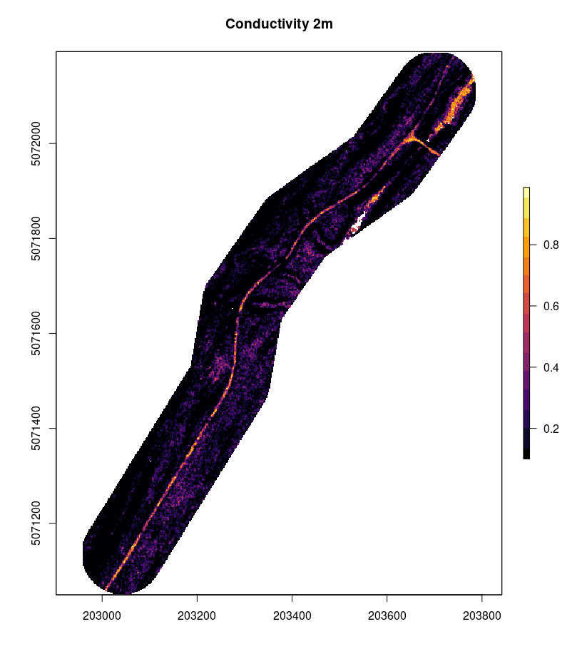

```{r,echo=FALSE,message=FALSE,warning=FALSE}
library(lidR)
library(ggplot2)
library(raster)
library(sf)

r3dDefaults = rgl::r3dDefaults
m = structure(c(0.921, -0.146, 0.362, 0, 0.386, 0.482, -0.787, 0, 
-0.06, 0.864, 0.5, 0, 0, 0, 0, 1), .Dim = c(4L, 4L))
r3dDefaults$FOV = 50
r3dDefaults$userMatrix = m
r3dDefaults$zoom = 0.75

knitr::opts_chunk$set(
  comment =  "#>", 
  collapse = TRUE,
  fig.align = "center")

rgl::setupKnitr(autoprint = TRUE)
knitr::opts_chunk$set(echo = TRUE)
#Case study 1: DTM compx

las_infolder <- ("data/06/01/ctg/")
ctg_cs1 <- readLAScatalog(las_infolder, filter = "-drop_withheld -keep_random_fraction 0.25")
dtm_cs1 <- raster("data/06/01/DTM.tif")
dtm20 <- raster("data/06/01/DTM20.tif")
rds_cs1 <- st_read("data/06/01/roads.shp")
upd_rds_cs1 <- st_read("data/06/01/upd_roads.shp") # Standard Parameters

#Case study 2: Vegetation and narrow
las_cs2 <- readLAS("data/06/03/ctg/1kmZ157050546602020L.laz")
las_infolder <- ("data/06/03/ctg/")
ctg_cs2 <- readLAScatalog(las_infolder, filter = "-drop_withheld -keep_random_fraction 0.25")
dtm_cs2 <- raster("data/06/03/DTM.tif")
road_cs2 <- st_read("data/06/03/road.shp")
road_buffer <- st_read("data/06/03/road_buffer.shp")
chm_cs2 <- raster("data/06/03/chm.tif")
chm_cs2_clip <- raster("data/06/03/chm_clip.tif")
conduct_cs2 <- raster("data/06/03/conductivity.tif")
upd_cs2 <- measure_road(ctg = ctg_cs2, centerline = road_cs2, dtm = dtm_cs2, keep_class = 4)

#Casestudy 3: Water
las_infolder <- ("data/07/ctg/")
ctg_cs3 <- readLAScatalog(las_infolder, filter = "-drop_withheld -keep_random_fraction 0.25")
las_cs3 <- readLAS("data/07/ctg/1kmZ174660536302018L.laz")
dtm_cs3 <- raster("data/07/DTM.tif")
road_cs3 <- st_read("data/07/road.shp")
updated_road_cs3 <- st_read("data/07/updated_road.shp") #no water

```

# Case Studies {#sec-case-studies}

In this section, we present four case studies where the `measure_road()` standard parameters (see section \@ref(sec-standard-parameters) may require tuning:

-   **Case Study 1: Low DTM complexity**
-   **Case Study 2: Dense vegetation on narrow roads**
-   **Case Study 3: Over water bodies**

## Case Study Structure:

For each case study, we include code snippets outlining how to:

1.  Read the required input data (refer to section \@ref(sec-reading-generating-and-plotting-input-data) for detailed information).
2.  Check the Coordinate Reference System (CRS) of input data and clip the existing road network to the spatial extent of the LAS catalog.
3.  Update the existing road network using the `measure_roads()` function from the `ALSroads` package.
4.  Adjust the standard road extraction parameters to improve method accuracy (see section \@ref(sec-standard-parameters) for information on the standard parameters).
5.  Visualize road extraction results.

Each case study is 'stand-alone', and users do not need to refer to other sections of the user guide. As such, some code snippets, such as loading data, are repeated for each case study.

## Case Study 1: Low DTM complexity {#sec-case-study-low-dtm-complexity}

### Overview:

The road extraction method developed by [Roussel et al. (2022)](https://www.sciencedirect.com/science/article/pii/S1569843222002084#d1e1483) uses the geometry of the terrain to relocate and measure the roads correctly. Under ideal circumstances, a road is expected to be flat with steep slopes on its edges (shoulders or embankments). The road is embedded within an environment and surrounded by complex and non-flat topography.

Under these assumptions, a road is not that hard to find and measure. However, problems arise when there is no geometry to detect. This may happen, for example, if the roads are not shaped with ditches on their sides. In this case, the algorithm is supposed to work with a "rescue method" (see section \@ref(sec-terrain-parameters)) that does not use the shoulders but instead the terrain complexity.

Ultimately, if the terrain is perfectly flat, there are no geometrical features that can be used to detect the road. In the following example, we present a method for adjusting the `measure_roads()` standard parameters to detect roads in a landscape where the topography is almost perfectly flat, roads are not nicely shaped, and standard road extraction is challenging.

As the 3D plot of the ground points demonstrates here, the road is easily identifiable, but no geometrical feature can be used to measure it. The road is flat in a flat environment.

```{r, disp = FALSE}
las <-  readLAS("data/06/01/road_10462.las")
plot(filter_ground(las), bg = "white")
```

The road extraction method computes a conductivity layer from the point cloud to estimate how easy/difficult it is for an agent to move between two adjacent pixels. Let’s look at the conductivity layer of the road in this case study:

```{r}
sig = ALSroads::rasterize_conductivity(las, dtm_cs1)
plot(sig, col = viridis::inferno(50))
```
As we can see, the conductivity map is perfect. Geometrical features (shoulders or embankments) are not that important to locate the road. Many other features are used, including vegetation and the local density of points. Thus the road centerline will be perfectly relocated even if the road is flat in a flat environment.

The measurement of the road width is likely to fail because of the absence of clear geometry (shoulders or embankments). Below we can see a slice of the point cloud perpendicularly to the road. For a better understanding of the figure, users should refer to section \@ref(sec-standard-parameters). The key focus of this figure is the red and green arrows that represent the total road width and the drivable width, respectively. The algorithm has determined the road to be 21 m wide, which is clearly incorrect in this case study. The algorithm overestimates the road width in this case study because the landscape surrounding the road is perfectly flat, and there is nothing to constrain the road width.


By altering the default `measure_roads()` parameter to be more aggressive and less tolerant to various sources of noise, we can relocate the road more accurately.


In this specific slice, 6 m is probably a minor underestimation of the actual road width. Users must remember that measurements are performed on numerous consecutive slices and averaged (see section \@ref(sec-extraction-parameters) for information on road slices). For this specific road, the default parameters result in the road being classified as a 13.6 m wide (total width) 'Class 2' road. Once the parameters are adjusted, the road is classified as a 7.6 m (total width) 'Class 1' road. The custom parameters result in a road width and road Class more representative of the actual road.

If the method classifies the road width as 13.6 m, many points will be found above the road (i.e., vegetation). This interpretation impacts the road classification (see section \@ref(sec-state-parameters)) as the method assesses the road as having vegetation on it, which would limit road drivability. However, suppose the actual road width is only 7.6 m. In that case, the algorithm will not find vegetation on the road, as this vegetation is beyond the road edge boundaries, and the road will be determined to be a very clean 'Class 1' road.

Tuning the \`measure_roads()\` parameters on a road-by-road basis is impossible and unsuitable for updating extensive forest road networks. Doing so would defeat the method's purpose, which is automatically updating road networks. Instead of tuning parameters to suit individual roads, users should tune parameters by landscape.

In this case study, the custom parameters work well, but the default parameters are generally preferable. It is important to remember that this is an **edge case** and represents an extreme scenario.

### Data, Method, and Application: {#sec-method-and-application}

The following sections present example code and method implementation for adjusting `measure_roads()` parameters in a low DTM complexity case study.

### Required R Packages: {#sec-required-r-packages}

``` r
remotes::install_github("Jean-Romain/ALSroads") #Install the ALSroads Package

library("ALSroads") 
library("lidR")
library("raster")
library("sf")
library("ggplot2")
```

#### Loading Data: {#sec-loading-data}

``` r
ctg <- readLAScatalog"path/to/ctg/files", filter = "-drop_withheld-keep_random_fraction 0.25")
dtm <- raster("path/to/dtm.tif")
roads <- st_read("path/to/roads")

st_crs(roads) = st_crs(ctg)
roads = sf::st_crop(roads, ctg)
```

#### Parameter Tuning {#sec-parameter-tuning}

The `measure_roads()` **terrain parameters** dictate how the method handles DTM complexity (see section \@ref(sec-terrain-parameters)). The standard terrain parameters are:

1.  max_elevation_ground_points: `Default = 0.1`
2.  max_sd_ground_points: `Default = 0.15`

In a low DTM complexity area, decreasing the `max_elevation_ground_points` and `max_sd_ground_points` improves the accuracy of road extraction. **In this case study, we decrease the `max_elevation_ground_points` to 0.07 and the `max_sd_ground_points` to 0.04.**

``` r
custom_param = alsroads_default_parameters
custom_param$terrain$max_elevation_ground_points = 0.07
custom_param$terrain$max_sd_ground_points = 0.04

updated_roads_custom_param <- measure_roads(ctg = ctg, roads = roads, dtm = dtm, param = custom_param)
```

### Results: {#sec-results}

Plotting the updated road network alongside the existing road network allows the visualization of the updated roads.

```{r, echo = FALSE, fig.width = 7.1, fig.height = 7}
poly = mapply(function(x,y)
{
  x = st_geometry(x)
  if (!is.na(y)) 
    x = st_buffer(x, dist = y) 
  else 
    x = st_buffer(x, dist = 0.1)
  return(st_sf(st_sfc(x)))
}, 
st_geometry(upd_rds_cs1), 
upd_rds_cs1$ROADWID)
poly = do.call(c, poly)
st_crs(poly) = st_crs(upd_rds_cs1)

plot(dtm_cs1, col = gray((0:25)/25))
plot(st_geometry(rds_cs1), add = T)
col = c("lightgray", "darkgreen", "orange", "red", "black")[upd_rds_cs1$CLASS+1]
plot(poly, add = T, col = col, border = col, lwd = 2)
```


## Case Study 2: Narrow road with Vegetation {#sec-case-study-veg}

### Overview:

THIS WRITING IS A COMBINATION OF SEVERAL CASE STUDIES. 
THE IDEA IS THAT THIS CASE STUDY SHOWS USERS HOW TO CHNAGE PARAMETERS IN SPECIFIC CIRCUMSTANCES: 
1. They have narrow roads and can drive them 
2. They are okay with more vegetation on the road

> This text will be edited 

The road extraction method developed by [Roussel et al. (2022)](%5Bhttps://www.sciencedirect.com/science/article/pii/S1569843222002084#d1e1483) updated an existing road network by searching within a buffer area of the existing road for an updated road line. The algorithm processes only the point cloud within the buffer around the reference roads (see section \@ref(sec-extraction-parameters)). This value corresponds to the biggest road offset error (i.e., how incorrect the existing road track is) that can be fixed by the method. There are three possible vegetation scenarios: 1) the road is nicely shaped by vegetation and the algorithm can accurately update the road, 2) DTM is very flat and locating the road is a challenge (see Case Study 1: Low DTM complexity), or 3) the road is not highlighted enough compared to the surrounding vegetation and cannot be located.

In some circumstances users may know that the updated is beyond the standard road buffer distance (80 m) and tune the `road_buffer` parameter accordingly. Similar, if a user knows that the maximum road track error is less than the standard buffer the`road_buffer`can be reduced to increase accuracy and reduce computation.

In this case study we will demonstrate a scenario where the standard vegetation parameters (see section \@ref(sec-vegetation-parameters)) are adjusted to detect roads, where vegetation growth on the road is known to be high. For example, users may know that in their study areas roads are drivable even if the percentage of vegetation above 50 cm in height on the road is over 50%. 

As the 3D plot of the ground points demonstrates, the road is identifiable, but there is vegetation on the road and the road is narrow.
The road extraction method developed by [Roussel et al. (2022)](%5Bhttps://www.sciencedirect.com/science/article/pii/S1569843222002084#d1e1483) updates an existing road network by assigning a Class (1-4), which indicates the road stare, to each road. The class is defined by assessing several road state parameters (see \@ref(sec-state-parameters)). It is **not** recommended for users to edit the road state parameters unless specifically required. For example, users may have a specific value for defining the `drivable_width_thresholds` of a road that exceeds the `measure_roads()` default thresholds (`c(1, 5)`).

In some circumstances users may know that the drivable width of a road is more or less than the standard thresholds and may tine the `drivable_width_threshold accordinginly.`

In this case study we demonstrate how users can tune `measure_roads()` parameters in an area where the the `drivable_width_thresholds` of roads exceed the standard parameters. The example case study roads are located in the eastern portion of the Nipissing Forest, in the province of Ontario.

> This text will be edited 


```r
las_clip <- clip_circle(ctg, 705200, 5466610, 15)
plot(las_clip, bg = "white", size = 3)
```

 We can look at the CHM model of the road:

```r
nlas <- normalize_height(las_clip, knnidw())
chm <- rasterize_canopy(nlas, res = 0.2, algorithm = p2r(subcircle = 0.15), pkg = "terra")
```
```{r chm-circle, disp = FALSE}
plot(chm_cs2_clip)
```

Running the measure roads detection we find that this road is a 'Class 4' road with a percentage canopy above the road of 58%. 

In this case: 
 - the road is very narrow, 
the road has a lot of vegetation above it


### Data, Method, and Application: {#sec-method-and-application}

The following sections present example code and method implementation for adjusting `measure_roads()` parameters form a vegetated and narrow road case study.

### Required R Packages: {#sec-required-r-packages}

``` r
remotes::install_github("Jean-Romain/ALSroads") #Install the ALSroads Package

library("ALSroads") 
library("lidR")
library("raster")
library("sf")
library("ggplot2")
```

#### Loading Data: {#sec-loading-data}

``` r
ctg <- readLAScatalog"path/to/ctg/files", filter = "-drop_withheld-keep_random_fraction 0.25")
dtm <- raster("path/to/dtm.tif")
roads <- st_read("path/to/roads")

st_crs(roads) = st_crs(ctg)
roads = sf::st_crop(roads, ctg)
```

#### Parameter Tuning {#sec-parameter-tuning}

The `measure_roads()` **extraction parameters** include a parameter called `road_buffer` for defining the road buffer width (see section \@ref(sec-extraction-parameters)). The default `road_buffer` distance is 80 m, but in this case study we know that the updated road is \< 10 m from the existing road network. **In this case study we decrees the `road_buffer` to 40 m**

``` r
custom_param = alsroads_default_parameters
custom_param$extraction$road_buffer = 40

updated_roads_custom_param <- measure_roads(ctg = ctg, roads = roads, dtm = dtm, param = custom_param)
```

### Results:

In this case study adjusting the `road_buffer` distance impacted the location road centerline. By comparing the 1) existing road network, 2) updated road using an 80 m buffer (the default value), and 3) the updated road using an 40 m buffer we can see that the road centerline location has altered:


#### Parameter Tuning:

The `measure_roads()` **road state parameters** include a parameter called `drivable_width_thresholds` for assigning drivable width thresholds (see section \@ref(sec-state-parameters)). The default `drivable_width_thresholds`are `c(1, 5)`, but in this case study we know roads under 3 m are not drivable, and roads over 8 m are good roads.

**We set the `drivable_width_thresholds` to `c(5, 8)`** meaning that roads with drivable widths over 8 m are assigned a score of 100 and roads with a width less than 5 m are assigned a score of 0 (there is a linear relationship between 5 and 8 m).

``` r
custom_param = alsroads_default_parameters
custom_param$state$drivable_width_thresholds = c(5, 8)

updated_roads_custom_param <- measure_roads(ctg = ctg, roads = roads, dtm = dtm, param = custom_param)
```

### Results (THESE ^ WILL BE COMBINED):

Results show that when the `drivable_width_thresholds` is changed to `c(5, 8)` fewer roads are classified as Class 1 and Class 2 (i.e., drivable roads). Compared to the updated road network using standard parameters, where no roads were Class 3 or 4, the updated road network using custom parameters includes two roads of Class 3 (i.e., not drivable). These results demonstrate that changing the `drivable_width_thresholds` impacts the road Class by considering roads beyond the minimum road width threshold, in this case 5 m, as not drivable. *Note: In this case study area there are no Class 4 roads.*

```{r}
ggplot(upd_rds_custom_and_standard_cs4, aes(factor(CLASS))) +   
  geom_bar(aes(fill = Param), position = "dodge", stat="count", width= 0.5) +
  theme_minimal() +
  theme(legend.position="bottom") +
  scale_fill_discrete(name=NULL, labels = c("Custom Parameters", "Standard Parameters")) +
  labs(y = "Count", x = "Road Class")
```


## Case Study 3: Road extraction over bridges

# Overview

Here, we provide two road extraction examples where a road crosses a waterbody. 

In this case study, we use the `measure_roads()` function to update a road crossing the Mattagami River (rivière Mattagami) in the Romeo Malette Forest, Ontario. The figure below visualizes the LAS tile used in this example and shows the river on the landscape.

``` r
las_c <- clip_circle(las, 466200, 5363600, 400)

x <- plot(las_c, bg = "white", size = 3)
add_dtm3d(x, dtm)
```


By plotting the road which crosses the Mattagami River on a base map, using the `mapView()` function, we can see that part of this road is a bridge. For more information on interactive plotting with `mapView(),` refer to section \@ref(sec-interactive-spatial-plotting).

```{r plot-waterbodies_cs1, warning = FALSE, fig.align='center', fig.width=8, fig.height=6}
url <- "https://servicesmatriciels.mern.gouv.qc.ca:443/erdas-iws/ogc/wmts/Inventaire_Ecoforestier/Inventaire_Ecoforestier/default/GoogleMapsCompatibleExt2:epsg:3/{z}/{y}/{x}.jpg"

m <- mapview::mapview(list(road_cs3),
                      layer.name = c("Waferboard_Road"),
                      col.regions=list("red"),
                      map.type = "Esri.WorldImagery")
leaflet::addTiles(m@map, url)
```


### Data, Method, and Application: {#sec-method-and-application}

The following sections present example code and method implementation for adjusting `measure_roads()` parameters form a vegetated and narrow road case study.

### Required R Packages: {#sec-required-r-packages}

``` r
remotes::install_github("Jean-Romain/ALSroads") #Install the ALSroads Package

library("ALSroads") 
library("lidR")
library("raster")
library("sf")
library("ggplot2")
```

#### Loading Data: {#sec-loading-data}

``` r
ctg <- readLAScatalog"path/to/ctg/files", filter = "-drop_withheld-keep_random_fraction 0.25")
dtm <- raster("path/to/dtm.tif")
roads <- st_read("path/to/roads")

st_crs(roads) = st_crs(ctg)
roads = sf::st_crop(roads, ctg)
```

### Updating Roads

``` r
updated_road <- measure_roads(ctg = ctg, roads = road, dtm = dtm)
```

Applying the `meaure_roads()` for a road crossing a waterboide, in this case, does not stop the method from updating the entire road. The width of the roads means that there are many points located on the bridge, and the algorithm interpreters the bridge as a road of Class 1, with an average driable width of 9.1 m,

```{r plot-rd, warning = FALSE, fig.align='center', fig.width=8, fig.height=6}
plot(dtm_cs3)
plot(updated_road_cs3[1], add = TRUE)
```


## Road covered by deciduous trees

In the following example the road is barely invisible from above because it is completely covered by deciduous trees. Using RGB images or using a CHM it is therefore impossible to find and measure the road. 

{width=70%}

However `ALSroad` only uses the CHM to find the road as one input among others. In this specific cases the road is visible in the DTM. It is also visible in the density of ground points.

{width=70%}

Overall the road is not invisible in lidar data even if some indicators may fail in this cases. Therefore this edge cases works out of the box and the conductivity layer highlight properly the road

{width=70%}

When running the `measure_road()` function the road is properly located and measured out of the box with default parameters. This road being particularly well shaped measuring it size is not a problem. Here the algorithm measured a 8.6 m class 1 road. In the image bellow we can see in purple the original inaccurate track of the official map and in yellow the new track with additional attributes

{width=70%}