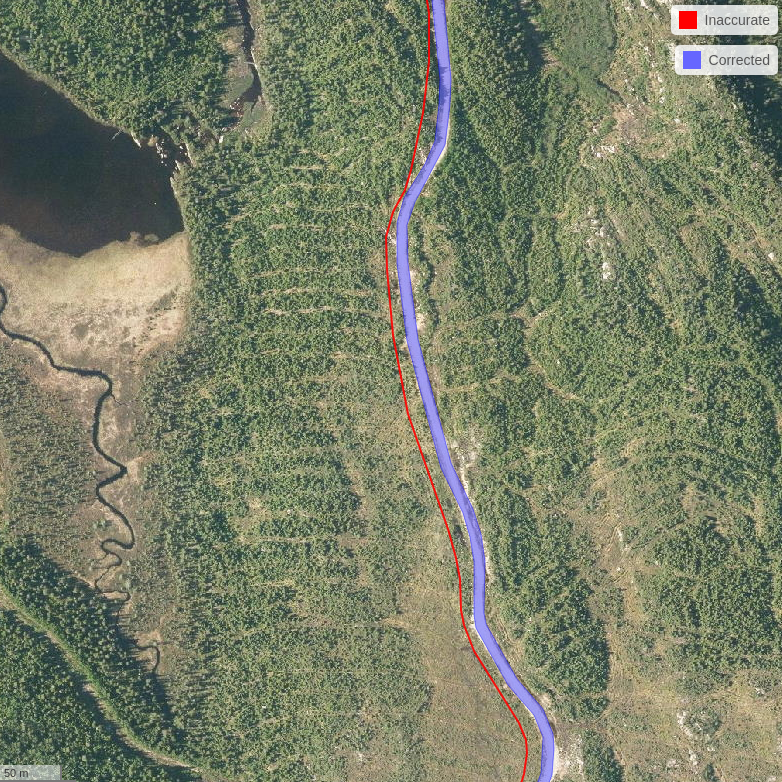

# Introduction {#sec-introduction}

`ALSroads` is an R package for correcting, updating, and enhancing vectorial forest road maps using airborne laser scanning (ALS) data. Using a reference map and an ALS point-clouds the method -- which is described in [Roussel et al. (2022)](https://www.sciencedirect.com/science/article/pii/S1569843222002084#d1e1483) -- relocates more accurately the path, measure the width and assigns a class to the roads. In the following figure, the read line is the road recorded in the database maintained by an authority. This line is not associated to any information about the road state. We can also see that the path is no accurate and does not follow accurately the real road. The method uses this line as prior information to relocate the real path and measure extra attributes. Here the algorithm found that the road is of class 1 (good state) and its width is 9 m.

The `ALSroads` package is open source and integrated within the geospatial R ecosystem (i.e., `raster` and `sf`). The package utilizes the `lidR` package, developed for manipulating and visualizing ALS data. This user guide has been written to support users with variable levels of experience working with LiDAR data.

Development of the `ALSroads` package was made possible by the financial support of the [Ministère des Forêts, de la Faune et des Parcs du Québec, Canada (MFFP)](https://mffp.gouv.qc.ca/).

Testing of the `ALSroads` package in Ontario was made possible by the [Forestry Futures Trust Ontario](http://www.forestryfutures.ca/) (Project number: KTTD 2B-2021) and an NSERC Discovery grant (RGPIN-2018-03851), grantee [Prof. Nicholas C. Coops](https://forestry.ubc.ca/faculty-profile/nicholas-coops/).

-----------------------------

